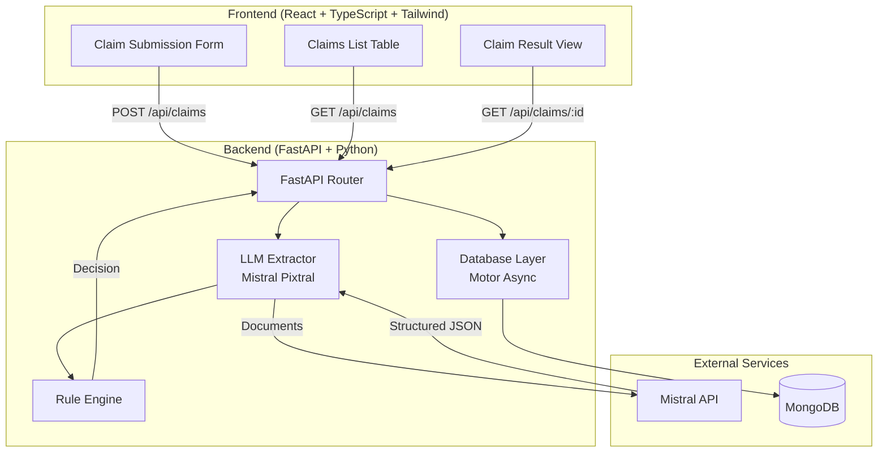
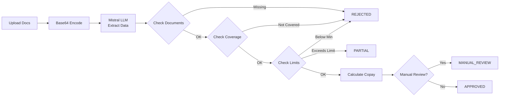

# Plum OPD Insurance Claim Adjudication Tool

> AI-powered OPD insurance claim processing using Mistral (Pixtral) for document extraction and a rule-based engine for adjudication decisions.

---

## Architecture



## Claim Processing Pipeline



---

## Quick Start

### Prerequisites

- **Python 3.10+**
- **Node.js 18+**
- **MongoDB** running on `localhost:27017`
- **Mistral API Key** (create one in the Mistral console)

### 1. Backend Setup

```bash
cd backend

# Create virtual environment
python -m venv venv
venv\Scripts\activate       # Windows
# source venv/bin/activate  # macOS / Linux

# Install dependencies
pip install -r requirements.txt

# Configure environment
copy .env.example .env
# Edit .env and add your MISTRAL_API_KEY

# Start the server
uvicorn main:app --reload --port 8000
```

### 2. Frontend Setup

```bash
cd frontend

# Install dependencies
npm install

# Start dev server (proxies API to localhost:8000)
npm run dev
```

Open [http://localhost:5173](http://localhost:5173) in your browser.

---

## API Documentation

### `POST /api/claims`

Submit a new OPD claim with medical documents.

| Parameter     | Type   | Required | Description                          |
| ------------- | ------ | -------- | ------------------------------------ |
| `files`       | File[] | ✅       | Medical documents (PDF/images)       |
| `member_name` | string | ✅       | Name of the insured member           |
| `member_id`   | string | ✅       | Unique member identifier             |
| `policy_id`   | string | ❌       | Policy ID (default: `PLUM_OPD_2024`) |

**Response:** Full claim object with extracted data and adjudication decision.

### `GET /api/claims`

List all claims (paginated).

| Parameter | Type | Default | Description           |
| --------- | ---- | ------- | --------------------- |
| `skip`    | int  | 0       | Offset for pagination |
| `limit`   | int  | 50      | Max results           |

### `GET /api/claims/{claim_id}`

Get full details of a single claim including decision and extracted data.

### `GET /api/health`

Health check endpoint.

---

## Rule Engine Checks

The rule engine runs these checks **in order**:

| #   | Check               | Failure Outcome                        |
| --- | ------------------- | -------------------------------------- |
| 1   | Document Validation | REJECT if prescription/bill missing    |
| 2   | Coverage Check      | REJECT if treatment not covered        |
| 3   | Limits Check        | REJECT if below min; PARTIAL if capped |
| 4   | Copay Calculation   | Deducts copay % from approved amount   |
| 5   | Manual Review Flag  | Routes to manual review if needed      |

---

## Project Structure

```
Assiagement/
├── backend/
│   ├── data/
│   │   └── policy_terms.json      # Policy configuration
│   ├── main.py                    # FastAPI app + routes
│   ├── extractor.py               # Mistral LLM document extraction
│   ├── rule_engine.py             # Adjudication rule engine
│   ├── models.py                  # Pydantic models
│   ├── database.py                # MongoDB CRUD layer
│   ├── requirements.txt
│   └── .env.example
├── frontend/
│   ├── src/
│   │   ├── components/
│   │   │   ├── ClaimSubmission.tsx # Upload form
│   │   │   ├── ClaimResult.tsx     # Decision display
│   │   │   └── ClaimsList.tsx      # Claims table
│   │   ├── App.tsx                # Router + Nav
│   │   ├── main.tsx               # Entry point
│   │   └── index.css              # Tailwind + design system
│   ├── index.html
│   ├── vite.config.ts
│   └── package.json
└── README.md
```

---

## Environment Variables

| Variable          | Required | Default                     | Description            |
| ----------------- | -------- | --------------------------- | ---------------------- |
| `MISTRAL_API_KEY` | ✅       | —                           | Mistral API key        |
| `MISTRAL_MODEL`   | ❌       | `pixtral-12b-2409`          | Mistral vision model   |
| `MONGODB_URL`     | ❌       | `mongodb://localhost:27017` | MongoDB connection URL |
| `DATABASE_NAME`   | ❌       | `plum_claims`               | Database name          |

---

## Assumptions

1. **Single policy**: The system ships with one policy (`PLUM_OPD_2024`). Multi-policy support can be added by storing additional JSON files.
2. **Synchronous processing**: Claim adjudication happens inline during the POST request. For production, consider a queue-based async architecture.
3. **No authentication**: The current version has no auth layer. Add JWT/OAuth before deploying to production.
4. **Document size**: Files are sent to Mistral. Very large files may hit API limits.
5. **Currency**: All amounts are in Indian Rupees (₹).
6. **MongoDB indexes**: Created automatically on startup for `claim_id`, `member_id`, and `created_at`.
7. **CORS**: Open to all origins for development. Restrict in production.

---

## Tech Stack

| Layer    | Technology                        |
| -------- | --------------------------------- |
| Frontend | React 18, TypeScript, Tailwind v4 |
| Backend  | FastAPI, Python 3.10+             |
| Database | MongoDB (Motor async driver)      |
| AI/LLM   | Mistral Pixtral (vision)          |
| Icons    | Lucide React                      |
| HTTP     | Axios                             |

---

## License

Internal tool for Plum Benefits. All rights reserved.
